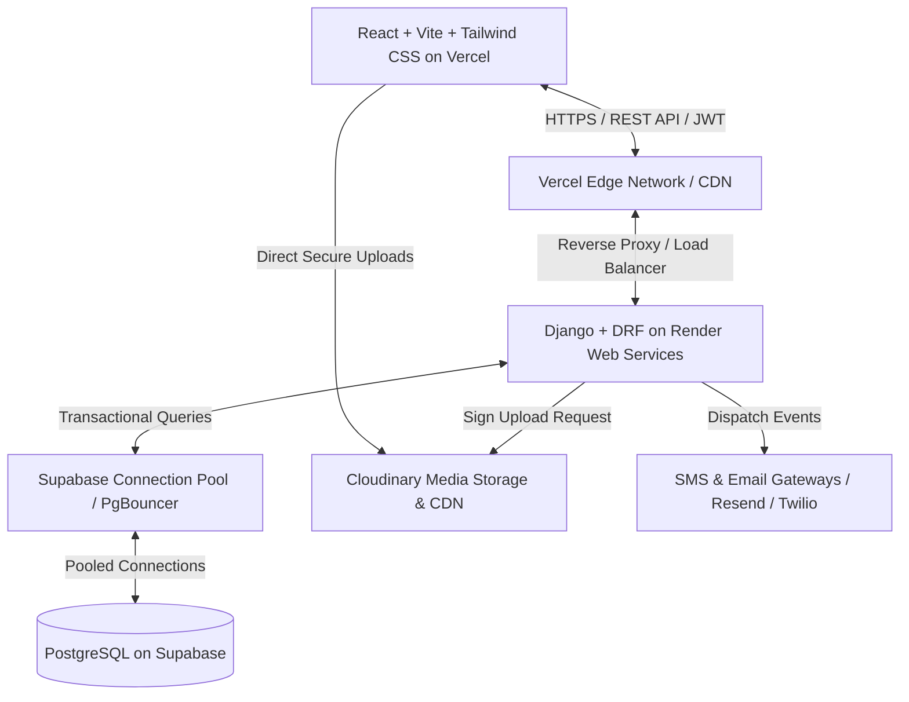
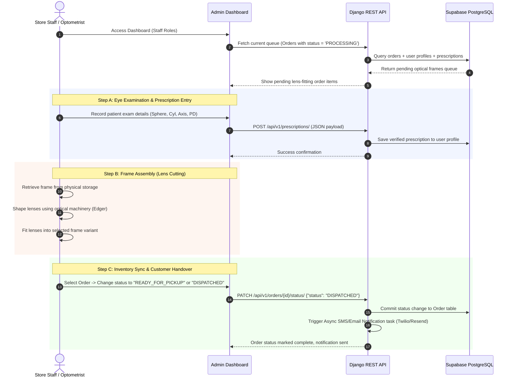
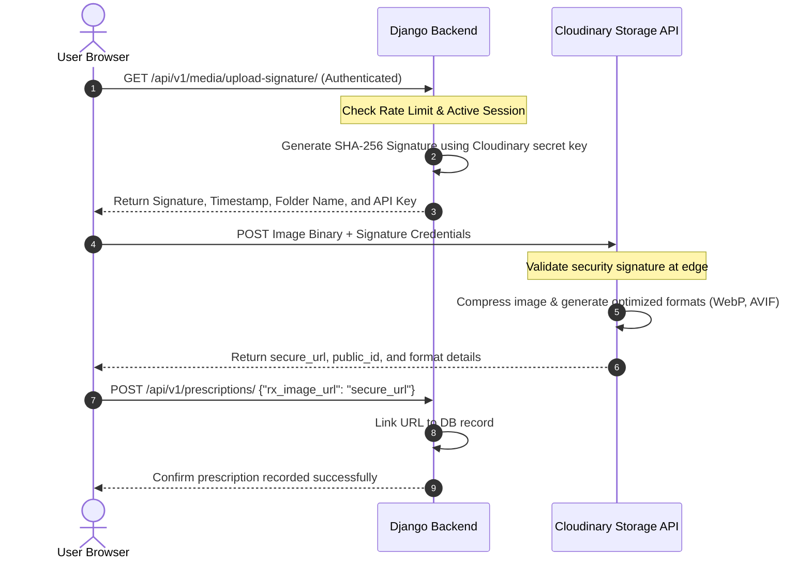

# Production-Ready Architecture Design: HR Frames Nellore

This document establishes the production-ready architectural design, folder structure, database flow, API specification, media storage pipelines, admin flows, security protocols, and performance strategies for **HR Frames Nellore**—a modern digital storefront and retail-clinic management system for eyewear, prescription lens fitting, and eye examination booking.

---

## 1. Project Architecture

The application implements a decoupled, modern Jamstack-like architecture where the user-facing web app operates independently of the backend REST API. This minimizes latency, lowers infrastructure costs, and optimizes each tier for its specific scaling needs.



### Key Infrastructure Topology:
*   **Frontend Tier (Vercel)**: Serves static assets, routes React pages client-side, and leverages Vercel's global Edge network to cache static shell components and image resources.
*   **API Tier (Render)**: Hosts the Django application within Docker containers. Render manages horizontal autoscaling based on incoming CPU and memory metrics. Gunicorn serves as the WSGI server with Uvicorn workers to support potential asynchronous views.
*   **Database Tier (Supabase)**: Provides a managed PostgreSQL 15+ database instance. The application connects via **PgBouncer** (connection pooling) to manage backend database connection allocation efficiently.
*   **Media & CDN (Cloudinary)**: Offloads heavy media assets (frames gallery, prescription receipts) from the web server. Assets are dynamically processed, optimized, and served from the nearest edge server.

---

## 2. Folder Structures

### Frontend: React + Vite + TailwindCSS
We utilize a **feature-based** organization paradigm. Features represent self-contained domain contexts (e.g., `catalog`, `appointments`) containing their own components, state management hooks, helper utilities, and backend clients.

```text
hr-frames-frontend/
├── .github/workflows/          # CI/CD pipelines (linting, testing, deploying)
├── public/                     # Static files (favicon, logo, manifest.json)
├── src/
│   ├── assets/                 # Global assets (styles, fonts, images)
│   ├── components/             # Reusable global UI widgets
│   │   ├── ui/                 # Atomic design tokens (Button, Input, Badge, Dialog)
│   │   └── layout/             # Application structural shells (Header, Sidebar, Footer)
│   ├── config/                 # Axios clients, configuration variables, routes lists
│   ├── context/                # Light global context wrappers (AuthContext, ThemeContext)
│   ├── features/               # Domain-specific logic modules
│   │   ├── auth/               # Logins, user signups, and password resets
│   │   ├── catalog/            # Eyewear grids, details pages, category filters
│   │   ├── prescriptions/      # Prescription viewer, upload widgets, OCR status
│   │   ├── orders/             # Checkout funnel, payments integration, order tracking
│   │   └── appointments/       # Slot bookings, calendars, status notifications
│   ├── hooks/                  # Reusable custom hooks (useAuth, useDebounce, useMediaQuery)
│   ├── routes/                 # Navigation setup (Protected vs Public routes router definitions)
│   ├── services/               # Centralized base client wrapper and global interceptors
│   ├── utils/                  # Pure utility functions (currency formatters, date parses)
│   ├── App.jsx                 # React root component and layout providers wrapper
│   ├── index.css               # CSS variables and Tailwind directives
│   └── main.jsx                # DOM mounting execution script
├── .env.example                # Blueprint for local configuration variables
├── tailwind.config.js          # Tailwind styling rules extension
├── vite.config.js              # Vite build setup (plugins, path aliases)
├── package.json                # Project dependencies
└── README.md
```

### Backend: Django + Django REST Framework (DRF)
To ensure long-term codebase scale, we adopt a **modular application architecture**. Core application systems are structured inside a dedicated `apps/` directory, preventing the root project structure from becoming cluttered.

```text
hr-frames-backend/
├── .github/workflows/          # Backend CI/CD definitions
├── apps/                       # Custom business applications
│   ├── users/                  # Custom User model, profile schemas, permissions
│   │   ├── models.py
│   │   ├── serializers.py
│   │   ├── views.py
│   │   ├── urls.py
│   │   └── services.py         # Business logic decoupled from views
│   ├── catalog/                # Frames, lens classifications, inventory management
│   │   ├── models.py
│   │   ├── serializers.py
│   │   └── ...
│   ├── orders/                 # Invoices, transactions, shipping updates
│   │   └── ...
│   ├── prescriptions/      # Spherical, cylindrical, axis values storage
│   │   └── ...
│   └── appointments/           # Scheduling slot generators and booking records
│       └── ...
├── config/                     # Core system settings
│   ├── settings/
│   │   ├── __init__.py
│   │   ├── base.py             # Shared settings across environments
│   │   ├── development.py      # Development settings (DEBUG=True, console logs)
│   │   └── production.py       # Hardened production configurations
│   ├── urls.py                 # Core routing file
│   ├── wsgi.py                 # WSGI setup
│   └── asgi.py                 # ASGI setup
├── requirements/               # Segmented python dependencies
│   ├── base.txt
│   ├── local.txt
│   └── production.txt
├── .env.example                # Backend environment configuration variables blueprint
├── Dockerfile                  # Production container construction blueprint
├── docker-compose.yml          # Local Postgres + Redis cache orchestration helper
├── manage.py                   # Django CLI utility
└── README.md
```

---

## 3. Database Flow & Schema Design

The relational database model represents a multi-tenant client base, physical/digital inventory management, medical-grade prescriptions, and point-of-sale transactions.

### Database Entity-Relationship Model (ERD)

```mermaid
erDiagram
    USER ||--o| USER_PROFILE : "has profile"
    USER ||--o{ APPOINTMENT : "books slot"
    USER ||--o{ PRESCRIPTION : "possesses records"
    USER ||--o{ ORDER : "submits transaction"
    
    FRAME_BRAND ||--o{ FRAME : "manufactures frame"
    FRAME ||--o{ FRAME_VARIANT : "available in variant"
    FRAME_VARIANT ||--o{ ORDER_ITEM : "line item inside"
    
    PRESCRIPTION ||--o| ORDER_ITEM : "bound optional to"
    ORDER ||--|{ ORDER_ITEM : "contains elements"
    ORDER ||--o| TRANSACTION : "settled via"

    USER {
        bigint id PK
        varchar email UNIQUE
        varchar password
        varchar role "ADMIN | STAFF | OPTOMETRIST | CUSTOMER"
        boolean is_active
        timestamp created_at
    }

    USER_PROFILE {
        bigint id PK
        bigint user_id FK "UNIQUE"
        varchar first_name
        varchar last_name
        varchar phone_number "INDEX"
        text shipping_address
    }

    APPOINTMENT {
        bigint id PK
        bigint customer_id FK
        timestamp slot_time "INDEX"
        varchar status "PENDING | CONFIRMED | COMPLETED | CANCELLED"
        varchar optometrist_name
        text notes
    }

    PRESCRIPTION {
        bigint id PK
        bigint customer_id FK
        numeric od_sph "Right Eye Sphere"
        numeric od_cyl "Right Eye Cylinder"
        integer od_axis "Right Eye Axis"
        numeric os_sph "Left Eye Sphere"
        numeric os_cyl "Left Eye Cylinder"
        integer os_axis "Left Eye Axis"
        numeric pupillary_distance
        varchar rx_image_url
        date issue_date "INDEX"
        boolean is_verified
    }

    FRAME {
        bigint id PK
        varchar model_name UNIQUE
        bigint brand_id FK
        text description
        varchar gender "MALE | FEMALE | UNISEX | KIDS"
        varchar shape "RECTANGLE | ROUND | AVIATOR | CAT_EYE | OVAL"
        varchar material "METAL | ACETATE | TITANIUM | TR90"
        boolean is_active
    }

    FRAME_VARIANT {
        bigint id PK
        bigint frame_id FK
        varchar sku UNIQUE "INDEX"
        varchar color
        varchar size "S | M | L"
        numeric price
        integer stock_quantity
        varchar main_image_url
        text gallery_urls "JSON Array"
        boolean is_active
    }

    ORDER {
        bigint id PK
        bigint user_id FK
        varchar order_number UNIQUE "INDEX"
        varchar order_status "PENDING | PROCESSING | DISPATCHED | COMPLETED | CANCELLED"
        numeric total_amount
        text shipping_address
        timestamp created_at "INDEX"
    }

    ORDER_ITEM {
        bigint id PK
        bigint order_id FK
        bigint variant_id FK
        bigint prescription_id FK "NULLABLE"
        integer quantity
        numeric unit_price
    }

    TRANSACTION {
        bigint id PK
        bigint order_id FK "UNIQUE"
        varchar payment_gateway "RAZORPAY | STRIPE | CASH"
        varchar gateway_reference_id UNIQUE
        varchar status "PENDING | SUCCESS | FAILED"
        numeric amount
        timestamp transaction_time
    }
```

### Database Connection and Scaling Strategy:
1.  **Connection Pooling (PgBouncer)**: Django's database configuration points directly to Supabase's PgBouncer port (`6543`) using `transaction` mode. This ensures that database connection resources are released immediately after each SQL command execution.
2.  **Indexing Strategy**: 
    *   B-Tree indexes are configured on search criteria attributes (`FRAME_VARIANT.sku`, `APPOINTMENT.slot_time`, `ORDER.order_number`, `USER_PROFILE.phone_number`).
    *   Compound indexes are used on combinations like `(frame_id, is_active)` to speed up product list generation queries.
3.  **Soft Deletions**: We implement soft deletions for active entities like `FRAME` and `FRAME_VARIANT` (using `is_active` flags) to ensure references in historical order logs are never broken.

---

## 4. API Endpoints Structure

Our REST API adheres to strict versioning (`/api/v1/`). All POST/PUT/PATCH request bodies utilize JSON format, and responses are formatted as standard JSON objects.

### Error Response Shape
To maintain consistency, all API errors follow a standardized format:
```json
{
  "success": false,
  "error": {
    "code": "VALIDATION_ERROR",
    "message": "Invalid parameters provided.",
    "details": {
      "phone_number": ["This field must be formatted in E.164 style."]
    }
  }
}
```

### Endpoints Directory

| Method | Endpoint | Authentication | Description |
| :--- | :--- | :--- | :--- |
| **POST** | `/api/v1/auth/register/` | Public | Registers a new Customer user profile. |
| **POST** | `/api/v1/auth/login/` | Public | Returns access token + sets HTTPOnly Refresh token. |
| **POST** | `/api/v1/auth/refresh/` | Public | Rotates active short-lived JWT token via Refresh token cookie. |
| **POST** | `/api/v1/auth/logout/` | JWT Bearer | Revokes current JWT sessions (blacklists token). |
| **GET** | `/api/v1/users/me/` | JWT Bearer | Retrieves active authenticated user details. |
| **GET** | `/api/v1/catalog/frames/` | Public | Returns paginated list of frames with URL filters. |
| **GET** | `/api/v1/catalog/frames/{id}/` | Public | Full frame details with nested product variants. |
| **POST** | `/api/v1/catalog/frames/` | Staff/Admin | Inserts a new eyewear frame entry. |
| **PATCH** | `/api/v1/catalog/variants/{id}/`| Staff/Admin | Adjusts stock levels or pricing of specific frame variant. |
| **GET** | `/api/v1/appointments/slots/` | Public | Lists available booking time slots. |
| **POST** | `/api/v1/appointments/` | JWT Bearer | Schedules an eye exam appointment slot. |
| **GET** | `/api/v1/appointments/me/` | JWT Bearer | Displays user's booking history. |
| **PATCH** | `/api/v1/appointments/{id}/` | Staff/Admin | Updates status, doctor assignments, or notes. |
| **POST** | `/api/v1/prescriptions/` | JWT Bearer | Stores uploaded optical values + paper prescription URL. |
| **GET** | `/api/v1/prescriptions/me/` | JWT Bearer | Retrieves customer's current prescriptions. |
| **POST** | `/api/v1/orders/checkout/` | JWT Bearer | Processes selections, verifies stock, issues transaction token. |
| **POST** | `/api/v1/orders/payment-webhook/` | Webhook Signature | Verifies gateway signatures to mark order status as `PROCESSING`. |

---

## 5. Admin & Store Operations Flow

Managing physical custom products (cutting prescription lenses and fitting them to a customer's frame choice) requires a robust workflow connecting physical and digital actions.



---

## 6. Media Flow & Storage Policy

Prescription documents and optical frames require high-quality imagery. To prevent server bottlenecks caused by processing image binaries, we implement a **Signed Direct Upload** pattern directly to Cloudinary.



### Media Assets Optimization Strategy:
1.  **Format Auto-Selection (`f_auto`)**: Offloads conversion logic to Cloudinary. Chrome/Firefox clients receive lightweight AVIF/WebP assets, while older browsers fallback to standard PNGs/JPGs.
2.  **Quality Normalization (`q_auto`)**: Applies smart compression that dynamically strips unnecessary metadata, reducing the weight of high-res catalog photos by up to 60-70% with no perceived quality degradation.
3.  **Responsive Layout Generation (`w_auto,c_scale`)**: Generates optimized widths dynamically based on screen configurations. Large desktop displays receive full-width variants, while mobile clients load scaled-down resolutions.

---

## 7. Security Plan

Securing customer health data (optical prescriptions) and transaction routes requires robust security controls.

| Vulnerability Category | Risk Level | Mitigation Strategy | Implementation Details |
| :--- | :--- | :--- | :--- |
| **Authentication Hijack** | High | HttpOnly Cookies & Short-lived JWTs | Access token expires in 15 minutes. Refresh token is stored in a secure cookie: `HttpOnly`, `Secure`, `SameSite=Strict` with path restricted to `/api/v1/auth/refresh/`. |
| **Data Interception** | High | Strict TLS Encryption | Require HTTPS across all traffic. Configure `SecurityMiddleware` in Django: `SECURE_SSL_REDIRECT = True`, `SECURE_HSTS_SECONDS = 31536000`, and `SECURE_HSTS_INCLUDE_SUBDOMAINS = True`. |
| **Cross-Site Scripting (XSS)**| Medium | Strict CSP & Input Cleansing | Build React routes with a strict Content Security Policy (CSP) header. Use libraries like `DOMPurify` to clean HTML inputs before rendering them dynamically. |
| **Cross-Site Request Forgery**| Medium | CSRF Double-Submit & CORS | Set `django-cors-headers` to accept traffic only from the registered Vercel client subdomain. Enforce CSRF verification cookies on authenticated mutation API routes. |
| **Denial of Service (DoS)** | High | Rate Limiting & Edge Shielding | Configure `django-ratelimit` on authentication and payment routes. Vercel Edge rules shield static resources, while Render's load balancer drops burst requests. |
| **SQL Injection** | Medium | Django ORM Protection | Prevent raw SQL structures. All transactional views must use Django's ORM parameters, which compile queries securely using parameterized statements. |

---

## 8. Performance Strategy

Maintaining sub-second load times is critical for digital storefront conversions. The following configurations ensure performance optimization across the stack:

### Frontend Optimization
*   **Vite Code-Splitting**: Split the application bundle by wrapping page pathways in React `lazy()` and handling loading states via `Suspense`. This ensures users download only the views they are actively visiting.
*   **Zustand for State Management**: Avoid monolithic React Context layers that cause global re-renders. Use `Zustand` to manage sliced, independent state stores (e.g., cart, profile, local system status).
*   **Tailwind CSS Tree Shaking**: The Vite build pipeline runs CSS purging, stripping unused classes to ensure the production CSS file is minimized.

### Backend & Database Optimization
*   **N+1 Query Resolution**: Use Django's query parameters to load related tables in a single query:
    ```python
    # Bad: Causes a query per list item
    variants = FrameVariant.objects.all() 
    
    # Good: Loads main details in a single query
    variants = FrameVariant.objects.select_related('frame', 'frame__brand').all()
    ```
*   **Cache Management**: Configure Redis on Render to cache static public resource listings (e.g., brand lists, standard catalog filters) using Django's caching engine (`django.core.cache`).
*   **Client-Side Fetching Engine**: Use `SWR` or `@tanstack/react-query` on the React frontend. This provides automatic caching, background revalidation, and pagination state sharing without manual configuration.

---
