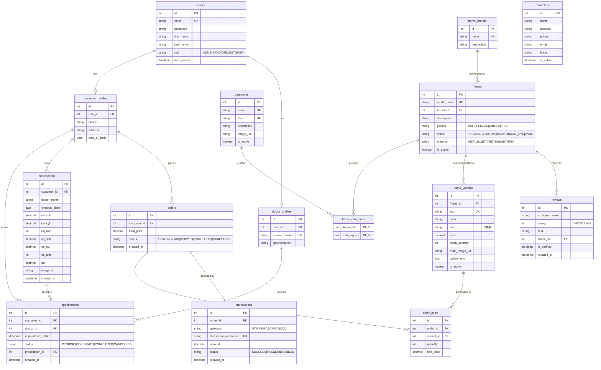

# MySQL Database Schema Specification

This document details the production-ready relational database schema design for **HR Frames Nellore** configured for MySQL.

---

## 1. Entity-Relationship (ER) Diagram

The following Mermaid diagram visualizes the tables, column keys, and the relational cardinality across users, catalog items, prescriptions, appointments, and transactions.



---

## 2. Production MySQL DDL Schema Script

Below is the complete database DDL statement declarations matching the ER Diagram:

```sql
CREATE DATABASE IF NOT EXISTS hr_frames_nellore CHARACTER SET utf8mb4 COLLATE utf8mb4_unicode_ci;
USE hr_frames_nellore;

-- Disable Foreign Key checks temporarily to allow clean drops in execution
SET FOREIGN_KEY_CHECKS = 0;
DROP TABLE IF EXISTS transactions;
DROP TABLE IF EXISTS order_items;
DROP TABLE IF EXISTS orders;
DROP TABLE IF EXISTS appointments;
DROP TABLE IF EXISTS prescriptions;
DROP TABLE IF EXISTS branches;
DROP TABLE IF EXISTS reviews;
DROP TABLE IF EXISTS frame_variants;
DROP TABLE IF EXISTS frame_categories;
DROP TABLE IF EXISTS frames;
DROP TABLE IF EXISTS frame_brands;
DROP TABLE IF EXISTS categories;
DROP TABLE IF EXISTS doctor_profiles;
DROP TABLE IF EXISTS customer_profiles;
DROP TABLE IF EXISTS users;
SET FOREIGN_KEY_CHECKS = 1;

-- --------------------------------------------------------------------------
-- 1. USERS & ROLES
-- --------------------------------------------------------------------------
CREATE TABLE users (
    id INT AUTO_INCREMENT PRIMARY KEY,
    email VARCHAR(150) NOT NULL UNIQUE,
    password VARCHAR(255) NOT NULL,
    first_name VARCHAR(100) NOT NULL,
    last_name VARCHAR(100) NOT NULL,
    role VARCHAR(20) NOT NULL DEFAULT 'CUSTOMER',
    date_joined DATETIME DEFAULT CURRENT_TIMESTAMP,
    CONSTRAINT chk_user_role CHECK (role IN ('ADMIN', 'DOCTOR', 'CUSTOMER'))
) ENGINE=InnoDB;

CREATE TABLE customer_profiles (
    id INT AUTO_INCREMENT PRIMARY KEY,
    user_id INT NOT NULL UNIQUE,
    phone VARCHAR(20) NOT NULL,
    address TEXT NOT NULL,
    date_of_birth DATE NULL,
    FOREIGN KEY (user_id) REFERENCES users(id) ON DELETE CASCADE
) ENGINE=InnoDB;

CREATE TABLE doctor_profiles (
    id INT AUTO_INCREMENT PRIMARY KEY,
    user_id INT NOT NULL UNIQUE,
    license_number VARCHAR(100) NOT NULL UNIQUE,
    specialization VARCHAR(150) NOT NULL,
    FOREIGN KEY (user_id) REFERENCES users(id) ON DELETE CASCADE
) ENGINE=InnoDB;

-- --------------------------------------------------------------------------
-- 2. CATALOG & PRODUCTS
-- --------------------------------------------------------------------------
CREATE TABLE categories (
    id INT AUTO_INCREMENT PRIMARY KEY,
    name VARCHAR(100) NOT NULL UNIQUE,
    slug VARCHAR(100) NOT NULL UNIQUE,
    description TEXT NULL,
    image_url VARCHAR(500) NULL,
    is_active BOOLEAN NOT NULL DEFAULT TRUE
) ENGINE=InnoDB;

CREATE TABLE frame_brands (
    id INT AUTO_INCREMENT PRIMARY KEY,
    name VARCHAR(100) NOT NULL UNIQUE,
    description TEXT NULL
) ENGINE=InnoDB;

CREATE TABLE frames (
    id INT AUTO_INCREMENT PRIMARY KEY,
    model_name VARCHAR(150) NOT NULL UNIQUE,
    brand_id INT NOT NULL,
    description TEXT NOT NULL,
    gender VARCHAR(20) NOT NULL DEFAULT 'UNISEX',
    shape VARCHAR(30) NOT NULL,
    material VARCHAR(30) NOT NULL,
    is_active BOOLEAN NOT NULL DEFAULT TRUE,
    FOREIGN KEY (brand_id) REFERENCES frame_brands(id) ON DELETE CASCADE,
    CONSTRAINT chk_frame_gender CHECK (gender IN ('MALE', 'FEMALE', 'UNISEX', 'KIDS')),
    CONSTRAINT chk_frame_shape CHECK (shape IN ('RECTANGLE', 'ROUND', 'AVIATOR', 'CAT_EYE', 'OVAL')),
    CONSTRAINT chk_frame_material CHECK (material IN ('METAL', 'ACETATE', 'TITANIUM', 'TR90'))
) ENGINE=InnoDB;

-- Many-to-Many Junction Table
CREATE TABLE frame_categories (
    frame_id INT NOT NULL,
    category_id INT NOT NULL,
    PRIMARY KEY (frame_id, category_id),
    FOREIGN KEY (frame_id) REFERENCES frames(id) ON DELETE CASCADE,
    FOREIGN KEY (category_id) REFERENCES categories(id) ON DELETE CASCADE
) ENGINE=InnoDB;

CREATE TABLE frame_variants (
    id INT AUTO_INCREMENT PRIMARY KEY,
    frame_id INT NOT NULL,
    sku VARCHAR(100) NOT NULL UNIQUE,
    color VARCHAR(50) NOT NULL,
    size VARCHAR(10) NOT NULL DEFAULT 'M',
    price DECIMAL(10,2) NOT NULL,
    stock_quantity INT NOT NULL DEFAULT 0,
    main_image_url VARCHAR(500) NOT NULL,
    gallery_urls JSON NULL, -- Stores secondary screenshots arrays
    is_active BOOLEAN NOT NULL DEFAULT TRUE,
    FOREIGN KEY (frame_id) REFERENCES frames(id) ON DELETE CASCADE,
    CONSTRAINT chk_variant_size CHECK (size IN ('S', 'M', 'L'))
) ENGINE=InnoDB;

-- --------------------------------------------------------------------------
-- 3. REVIEWS & CLINICAL BRANCHES
-- --------------------------------------------------------------------------
CREATE TABLE reviews (
    id INT AUTO_INCREMENT PRIMARY KEY,
    customer_name VARCHAR(100) NOT NULL,
    rating INT NOT NULL,
    text TEXT NOT NULL,
    frame_id INT NOT NULL,
    is_verified BOOLEAN NOT NULL DEFAULT TRUE,
    created_at DATETIME DEFAULT CURRENT_TIMESTAMP,
    FOREIGN KEY (frame_id) REFERENCES frames(id) ON DELETE CASCADE,
    CONSTRAINT chk_review_rating CHECK (rating BETWEEN 1 AND 5)
) ENGINE=InnoDB;

CREATE TABLE branches (
    id INT AUTO_INCREMENT PRIMARY KEY,
    name VARCHAR(150) NOT NULL,
    address TEXT NOT NULL,
    phone VARCHAR(20) NOT NULL,
    email VARCHAR(100) NOT NULL,
    hours VARCHAR(100) NOT NULL,
    is_active BOOLEAN NOT NULL DEFAULT TRUE
) ENGINE=InnoDB;

-- --------------------------------------------------------------------------
-- 4. CLINICAL PRESCRIPTIONS & CLINIC BOOKINGS
-- --------------------------------------------------------------------------
CREATE TABLE prescriptions (
    id INT AUTO_INCREMENT PRIMARY KEY,
    customer_id INT NOT NULL,
    doctor_name VARCHAR(150) NOT NULL,
    checkup_date DATE NOT NULL,
    od_sph DECIMAL(4,2) NOT NULL,
    od_cyl DECIMAL(4,2) NOT NULL,
    od_axis INT NOT NULL,
    os_sph DECIMAL(4,2) NOT NULL,
    os_cyl DECIMAL(4,2) NOT NULL,
    os_axis INT NOT NULL,
    pd DECIMAL(4,1) NOT NULL,
    image_url VARCHAR(500) NULL, -- Optional OCR source upload link
    created_at DATETIME DEFAULT CURRENT_TIMESTAMP,
    FOREIGN KEY (customer_id) REFERENCES customer_profiles(id) ON DELETE CASCADE
) ENGINE=InnoDB;

CREATE TABLE appointments (
    id INT AUTO_INCREMENT PRIMARY KEY,
    customer_id INT NOT NULL,
    doctor_id INT NOT NULL,
    appointment_date DATETIME NOT NULL,
    status VARCHAR(30) NOT NULL DEFAULT 'PENDING',
    prescription_id INT NULL,
    created_at DATETIME DEFAULT CURRENT_TIMESTAMP,
    FOREIGN KEY (customer_id) REFERENCES customer_profiles(id) ON DELETE CASCADE,
    FOREIGN KEY (doctor_id) REFERENCES doctor_profiles(id) ON DELETE CASCADE,
    FOREIGN KEY (prescription_id) REFERENCES prescriptions(id) ON DELETE SET NULL,
    CONSTRAINT chk_appointment_status CHECK (status IN ('PENDING', 'CONFIRMED', 'COMPLETED', 'CANCELLED'))
) ENGINE=InnoDB;

-- --------------------------------------------------------------------------
-- 5. ORDERS & PAYMENTS
-- --------------------------------------------------------------------------
CREATE TABLE orders (
    id INT AUTO_INCREMENT PRIMARY KEY,
    customer_id INT NOT NULL,
    total_price DECIMAL(10,2) NOT NULL,
    status VARCHAR(30) NOT NULL DEFAULT 'PENDING',
    created_at DATETIME DEFAULT CURRENT_TIMESTAMP,
    FOREIGN KEY (customer_id) REFERENCES customer_profiles(id) ON DELETE CASCADE,
    CONSTRAINT chk_order_status CHECK (status IN ('PENDING', 'PAID', 'SHIPPED', 'COMPLETED', 'CANCELLED'))
) ENGINE=InnoDB;

CREATE TABLE order_items (
    id INT AUTO_INCREMENT PRIMARY KEY,
    order_id INT NOT NULL,
    variant_id INT NOT NULL,
    quantity INT NOT NULL DEFAULT 1,
    unit_price DECIMAL(10,2) NOT NULL,
    FOREIGN KEY (order_id) REFERENCES orders(id) ON DELETE CASCADE,
    FOREIGN KEY (variant_id) REFERENCES frame_variants(id) ON DELETE CASCADE
) ENGINE=InnoDB;

CREATE TABLE transactions (
    id INT AUTO_INCREMENT PRIMARY KEY,
    order_id INT NOT NULL UNIQUE,
    gateway VARCHAR(50) NOT NULL,
    transaction_reference VARCHAR(150) NOT NULL UNIQUE,
    amount DECIMAL(10,2) NOT NULL,
    status VARCHAR(30) NOT NULL DEFAULT 'SUCCESS',
    created_at DATETIME DEFAULT CURRENT_TIMESTAMP,
    FOREIGN KEY (order_id) REFERENCES orders(id) ON DELETE CASCADE,
    CONSTRAINT chk_transaction_status CHECK (status IN ('SUCCESS', 'FAILED', 'REFUNDED'))
) ENGINE=InnoDB;
```

---

## 3. Database Indexes Configurations

To ensure fast search lookups and optimized query operations, the following indexes are declared:

```sql
-- Search Queries on Catalog Items
CREATE INDEX idx_frames_lookup ON frames (is_active, gender, shape, material);
CREATE INDEX idx_frame_variants_sku ON frame_variants (sku);
CREATE INDEX idx_frame_variants_price ON frame_variants (price);

-- Relationships Lookups (Foreign Keys mapping optimizer)
CREATE INDEX idx_frames_brand ON frames (brand_id);
CREATE INDEX idx_variants_frame ON frame_variants (frame_id);
CREATE INDEX idx_reviews_frame ON reviews (frame_id, rating);
CREATE INDEX idx_prescriptions_customer ON prescriptions (customer_id);
CREATE INDEX idx_appointments_date ON appointments (appointment_date, status);
CREATE INDEX idx_orders_customer ON orders (customer_id, status);

-- Text Match / Search filters (Prefix lookups)
CREATE INDEX idx_frames_model ON frames (model_name);
```

---

## 4. Optimized Query Examples

Below are standard queries executed by the application backend, optimized by the index configurations declared above:

### Query A: Fetch Catalog Grid with Brand names, active variants, and prices range
```sql
SELECT 
    f.id AS frame_id,
    f.model_name,
    b.name AS brand_name,
    f.shape,
    f.material,
    v.sku,
    v.color,
    v.size,
    v.price,
    v.stock_quantity
FROM frames f
INNER JOIN frame_brands b ON f.brand_id = b.id
INNER JOIN frame_variants v ON v.frame_id = f.id
WHERE f.is_active = TRUE 
  AND v.is_active = TRUE
  AND f.gender = 'UNISEX'
ORDER BY v.price ASC
LIMIT 12 OFFSET 0;
```
*   **Optimization**: Directly utilizes composite index `idx_frames_lookup` to perform search matches on `is_active` and `gender`, and runs foreign key index `idx_variants_frame` to join variants.

### Query B: Fetch average ratings and total reviews for frames
```sql
SELECT 
    f.id AS frame_id,
    f.model_name,
    COUNT(r.id) AS reviews_count,
    ROUND(AVG(r.rating), 1) AS average_rating
FROM frames f
LEFT JOIN reviews r ON r.frame_id = f.id
WHERE f.is_active = TRUE
GROUP BY f.id
HAVING average_rating >= 4.0;
```
*   **Optimization**: Directly uses composite index `idx_reviews_frame` containing `(frame_id, rating)` to fetch rating lists quickly without reading row data.

### Query C: Retrieve customer's latest active prescription specs
```sql
SELECT * 
FROM prescriptions
WHERE customer_id = 5
ORDER BY checkup_date DESC
LIMIT 1;
```
*   **Optimization**: Leverages the query-specific index `idx_prescriptions_customer` to avoid full-table scans.
